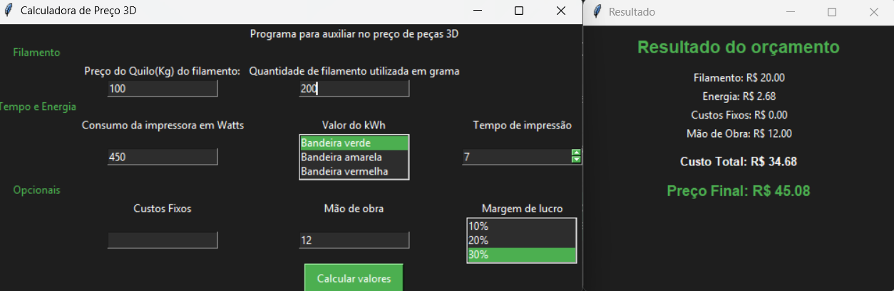

# 🖨️ Calculadora de Preço para Impressão 3D

Uma aplicação desenvolvida em **Python** utilizando **Tkinter** para auxiliar na precificação de peças produzidas em impressoras 3D.

O objetivo é facilitar o cálculo do custo de produção considerando consumo de filamento, energia elétrica, custos adicionais e margem de lucro, gerando rapidamente o preço final da peça.

---

## 📷 Interface

```

```

---

## ✨ Funcionalidades

- Cálculo do custo do filamento utilizado
- Cálculo do custo de energia elétrica
- Seleção da bandeira tarifária
- Inclusão de custos fixos
- Inclusão de custo de mão de obra
- Definição da margem de lucro
- Exibição detalhada dos custos
- Cálculo automático do preço final da peça

---

## 📋 Informações utilizadas no cálculo

### Obrigatórias

- Preço do quilograma do filamento
- Quantidade de filamento utilizada (g)
- Consumo da impressora (Watts)
- Bandeira tarifária da energia
- Tempo de impressão (horas)

### Opcionais

- Custos fixos
- Mão de obra

### Margem de lucro

É possível escolher margens entre:

- 10%
- 20%
- 30%
- ...
- até 500%

---

## 🧮 Como o cálculo é realizado

### Custo do filamento

```
Preço do filamento por grama = Valor do Kg / 1000
```

```
Custo do filamento = Preço por grama × Quantidade utilizada
```

### Custo da energia

```
Consumo (kWh) = Potência (W) × Tempo (h) / 1000
```

```
Custo da energia = Consumo × Valor do kWh
```

### Custo total

```
Custo Total =
Filamento +
Energia +
Custos Fixos +
Mão de Obra
```

### Preço Final

```
Preço Final =
Custo Total × (1 + Margem de Lucro)
```

---

## 🚀 Como executar

Clone o projeto

```bash
git clone https://github.com/BrunoAbr/calculadora3d.git
```

Entre na pasta

```bash
cd calculadora3d
```

Execute

```bash
python app.py
```

---

## 📁 Estrutura do projeto

```
.
├── app.py          # Interface gráfica
├── pricing.py        # Regras de cálculo
├── README.md
└── .gitignore
```

---

## 🛠 Tecnologias

- Python 3
- Tkinter

---

## 💡 Melhorias futuras

- Exportar orçamento em PDF
- Histórico de cálculos
- Cadastro de diferentes tipos de filamentos
- Cadastro de impressoras
- Valor do kWh configurável
- Temas claro e escuro
- Versão para Windows (.exe)

---

## 📄 Licença

Este projeto está disponível sob a licença MIT.